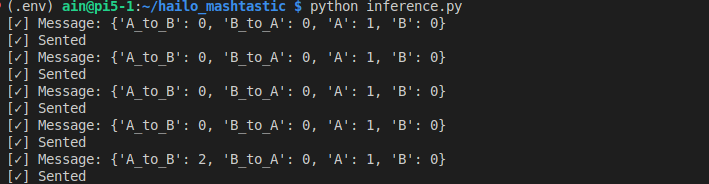

# Hailo AI Box with Mashtastic

This repo uses an AI Box to capture RTSP streams from IP cameras and tracks people with YOLO, accelerated by a 26 TOPS NPU. It divides the area into zones A and B, counts people moving between them, and sends results via Meshtastic to remote nodes for further processing.

## Hardware prepare

|                                                reComputer AI R2130                                              |
| :----------------------------------------------------------------------------------------------------------------: |
|  |
| [**Purchase Now**](https://www.seeedstudio.com/reComputer-AI-R2130-12-p-6368.html?utm_source=PiAICourse&utm_medium=github&utm_campaign=Course) |

|                                                reComputer AI R2130                                              |
| :----------------------------------------------------------------------------------------------------------------: |
|  |
| [**Purchase Now**](https://www.seeedstudio.com/XIAO-nRF52840-Wio-SX1262-Kit-for-Meshtastic-p-6400.html?utm_source=PiAICourse&utm_medium=github&utm_campaign=Course) |

## Hardware connection


## Run Project

>Note:
> You can change config.json to change your model path

```
git clone https://github.com/Seeed-Projects/Hailo-AI-Box-Mashtastic.git
cd Hailo-AI-Box-Mashtatic
python -m venv .env --system-site-packages
source .env/bin/activate
pip install -r requirements.txt
python inference.py
```

## Result

The message includes the number of people moving from Zone A to Zone B, the number moving from Zone B to Zone A, and the current number of people in both Zone A and Zone B.


